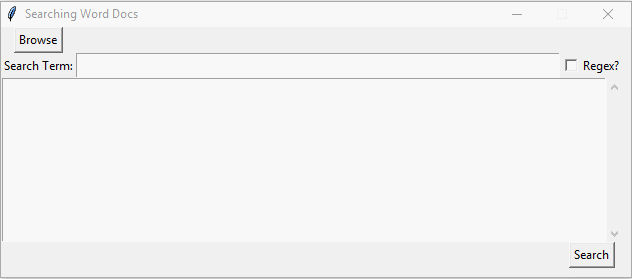
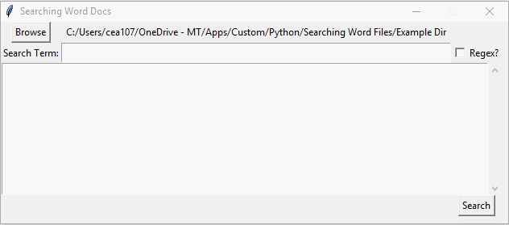
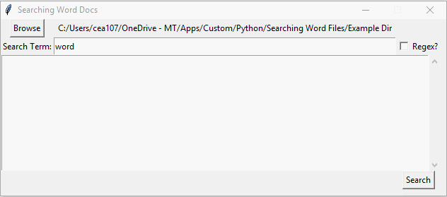
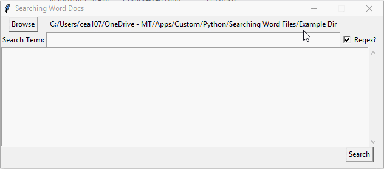

# SearchingWordFiles
A small Python utility program with a tkinter UI for searching Word files for some given text.

Compiled to an .exe thanks to [Brent Vollebregt](https://github.com/brentvollebregt)'s awesome [auto-py-to-exe](https://github.com/brentvollebregt/auto-py-to-exe) project. Thanks Brent!

## Usage

1. Run the program
  * If you're using the .exe, double click it.
  * If you're using the Comparing_Lists.py file, open a terminal and run:
  ```bash
  python Comparing_Lists.py
  ```
2. In the UI that opens, select the directory you want to search in:



3. Enter the term you want to search for:



4. Perform your search:



5. If you want to use regex:


